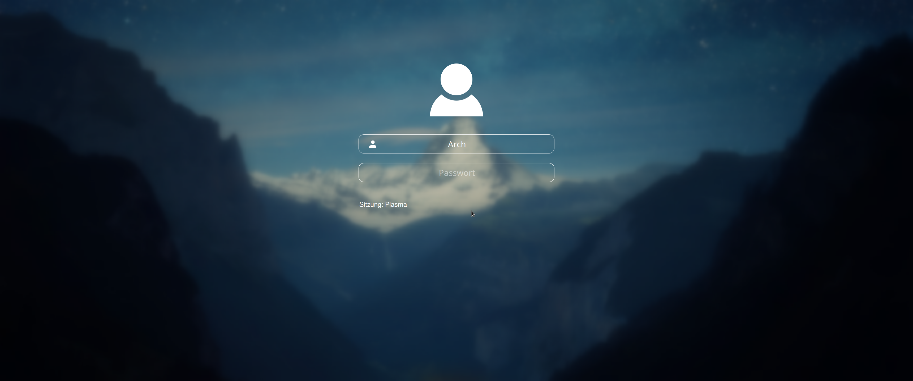

# Simple Login (SDDM Theme)

A SDDM theme with simple, modern look. The theme was kept as simple as possible and only the most necessary functions are integrated. There is a menu button to select the user and the desktop session. The login is done by entering the password in the password text field followed by an Enter Event. Not included are screen keyboard and shutdown buttons. Because the system can be shut down via hardware power button on the PC.

**Important Note**: The performance of the user menu and the desktop session menu on low performance hardware or in virtual box is extremely poor!



## Installation (Arch Linux)

```bash
sudo pacman -Sy sddm qt5 git
sudo git clone https://github.com/niki-on-github/simple-login-sddm-theme.git /usr/share/sddm/themes/simple-login
echo -e "[Theme]\nCurrent=simple-login" | sudo tee /etc/sddm.conf
```

or select theme in KDE System-Settings.
